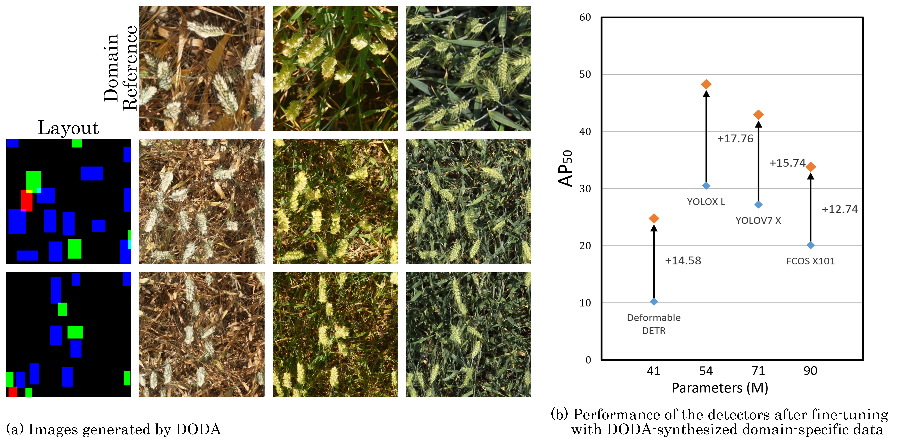

# DODA
This repository is the official implementation of Diffusion for Object-detection Domain Adaptation in Agriculture. 

DODA is a data synthesizer that can generate high-quality object detection data for new domains in agriculture, and help the detectors adapt to the new domains.




## Requirements

To install requirements:


```
conda create -y -n DODA python=3.8.5
conda activate DODA
pip install torch==1.13.0+cu116 torchvision==0.14.0+cu116 --extra-index-url https://download.pytorch.org/whl/cu116
pip install -r requirements.txt
```

### Download Datesets
```
bash Download_dataset.sh
```

### Prepare Datesets
```
python prepare_coco.py
python prepare_wheat_trainset.py   # If you only want to test the model`s performance on GWHD, there is no need to run this line
python prepare_Terraref_testset.py
```


## Training

You can download the pretained DODA-ldm, and run `tool_add_control.py` to add the ControlNet to the model:
```
python tool_add_wheat_control.py
```

the train the model by running:
```
python train_wheat.py
```


## Evaluation

Generate images according to the bounding boxes of the COCO 2017 validation set:
First download the pretrained DODA-L2I to `/models` folder, then run:
```
python generate_coco_testimg.py
```
Generate images according to the bounding boxes and reference images of the Terraref domain:
First download the pretrained DODA to `/models` folder, then run:
```
python prepare_Terraref_testset.py
```


If you want to generate data to train the detector, first generate layout images using `random_generate_layout_images.py`, then use `generate_data_for_target_domain.py` to generate the data.
If you want to generate data for your own domain, please refer to `generate_data_for_target_domain.py`


## Pre-trained Models

Pre-trained models will be provided after a few months.


